# Discriminative, Restorative, and Adversarial Learning: Stepwise Incremental Pretraining.
This repository provides a Keras implementation of the Discriminative, Restorative, and Adversarial Learning: Stepwise Incremental Pretraining

We extend and reimplement five prominent self-supervised learning methods and integrate them into a united framework that incorporates three learning components: Discriminative, Restorative, and Adversarial Learning. We then explore the stepwise training strategies that stabilize the united framework's training process and improve the overall performance for the target tasks.

The five self-supervised learning methods are Jigsaw, Rubik's Cube & Rubik's Cube++，Rotation, Deep CLustering, TransVW.

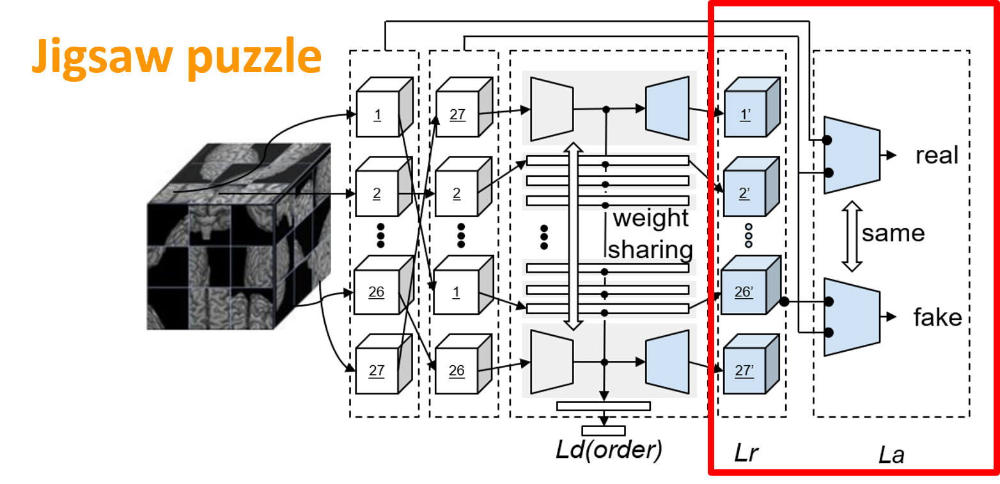
  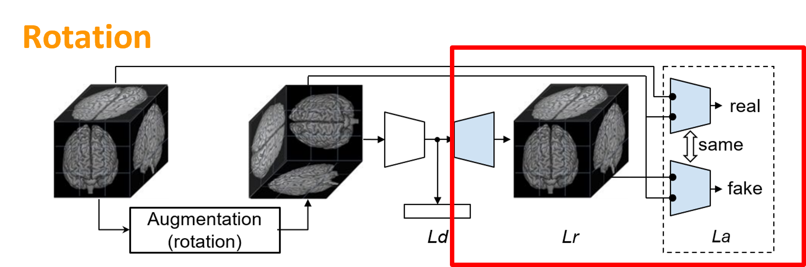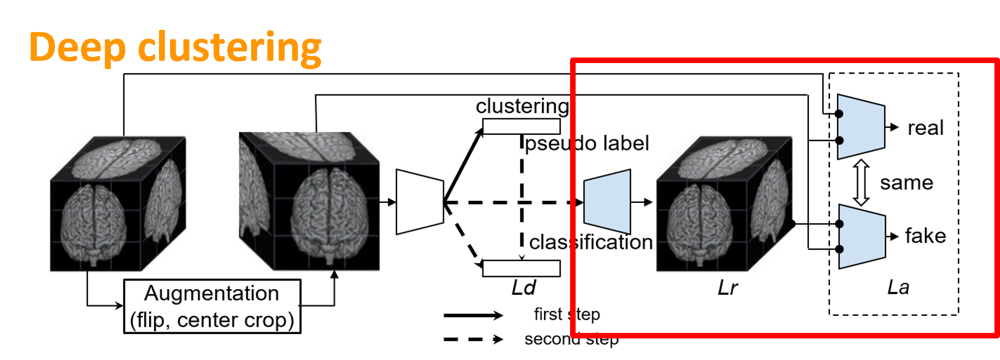
  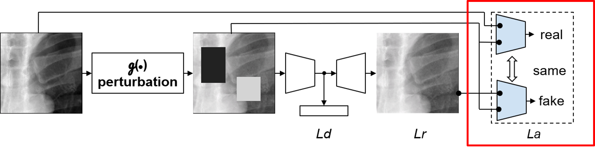

## Publication
<b>Discriminative, Restorative, and Adversarial Learning: Stepwise Incremental Pretraining </b>  
[Zuwei Guo](https://github.com/AbhorsenKnight)1, [Nahid Ul Islam](https://github.com/Nahid1992)1, [Michael B. Gotway](https://www.mayoclinic.org/biographies/gotway-michael-b-m-d/bio-20055566)2, [Jianming Liang](https://chs.asu.edu/jianming-liang)1 
1 Arizona State University, 2 Mayo Clinic  
Published in: **Domain Adaptation and Representation Transfer (DART), 2022.**

[Paper](#) | [Code](https://github.com/jlianglab/StepwisePretraining) | [Poster] | [Slides] | Presentation ([YouTube])

## Major results from our work
1. We found the optimum pretraining strategy for the United framework
Stepwise pretraining is always better than training everything together

  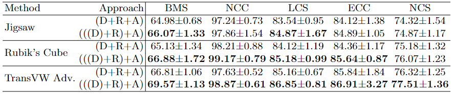

2. We found the effective utilization for pretrained components for target tasks.
a) For classification tasks, pretrained encoders perform much better than the randomly initialized encoders

  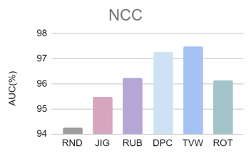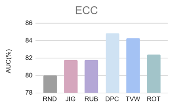

b) For segmentation tasks, the trained encoder also improves performance for most methods. But we also observed some negative transfer due to task mismatches.

  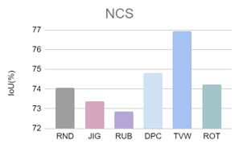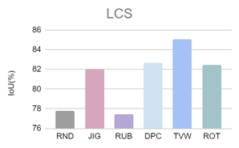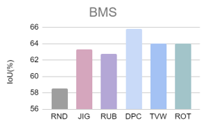

c) For segmentation tasks, we should always transfer pretrained decoders.

  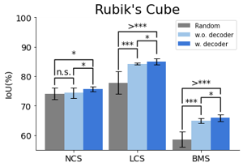
  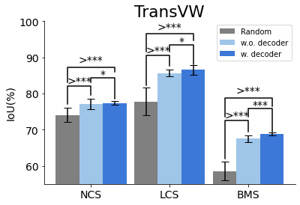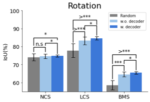

4) Adversarial training ((D)+R)+A strengthens learned representation

  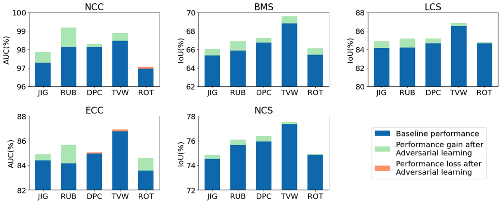

5) Adversarial training ((D)+R)+A reduces annotation costs

  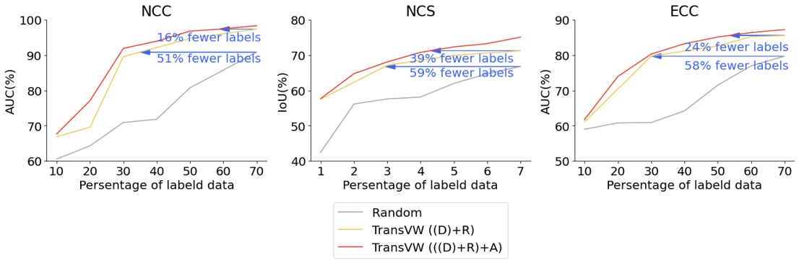

## Acknowledgement
This research has been supported in part by ASU and Mayo Clinic through a Seed Grant and an Innovation Grant, and in part by the NIH under Award Number R01HL128785. The content is solely the responsi- bility of the authors and does not necessarily represent the official views of the NIH. This work has utilized the GPUs provided in part by the ASU Research Computing and in part by the Extreme Science and Engineering Discovery Environment (XSEDE) funded by the National Science Foundation (NSF) under grant numbers: ACI-1548562, ACI-1928147, and ACI-2005632. The content of this paper is covered by patents pending.

## License

Released under the [ASU GitHub Project License](./LICENSE).
