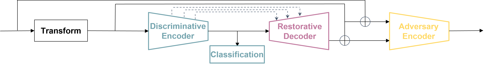
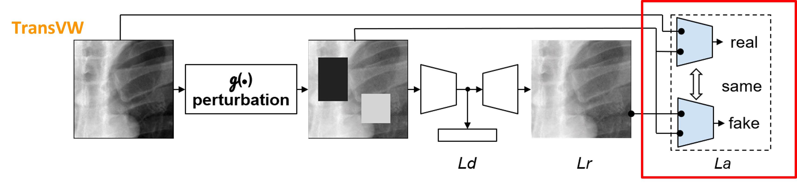

# Discriminative, Restorative, and Adversarial Learning: Stepwise Incremental Pretraining.
This repository provides a Keras implementation of the Discriminative, Restorative, and Adversarial Learning: Stepwise Incremental Pretraining

We extend and reimplemented five prominent self-supervised learning methods and integrate them into a united framework that incorporates three learning components including Discriminative, Restorative, and Adversarial Learning. 

The five self-supervised learning methods are Jigsaw, Rubik's Cube & Rubik's Cube++，Rotation, Deep CLustering, TransVW.

  
  

## Publication
<b>Discriminative, Restorative, and Adversarial Learning: Stepwise Incremental Pretraining </b>  
[Zuwei Guo](https://github.com/AbhorsenKnight)1, [Nahid Ul Islam](https://github.com/Nahid1992)1, [Michael B. Gotway](https://www.mayoclinic.org/biographies/gotway-michael-b-m-d/bio-20055566)2, [Jianming Liang](https://chs.asu.edu/jianming-liang)1 
1 Arizona State University, 2 Mayo Clinic  
Published in: **Domain Adaptation and Representation Transfer (DART), 2022.**

[Paper](#) | [Code](https://github.com/jlianglab/StepwisePretraining) | [Poster] | [Slides] | Presentation ([YouTube])

